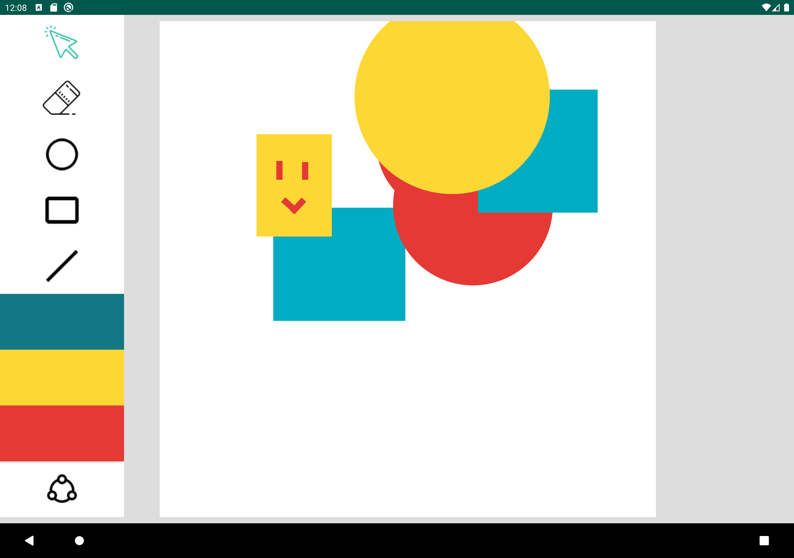
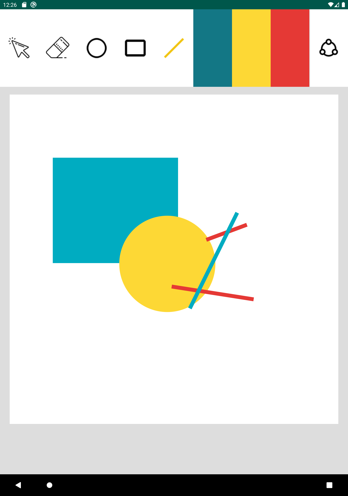
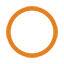

# JSketch 🖍
Fotag is an Android drawing playground developed using Java. 
The canvas of this drawing program allows user to drag and draw basic shapes such as rectangle, circle and line. 

## Preview
- Landscape View

- Portrait View

## Get Started
  - To get play with the application, please download the apk file shared in the repository.
  - The applcation is developed and tested using Pixel C (Google tablet) AVD with API 29. Please ensure the system requirements has been met.

## How to Use it
### Toolbar:
- Selection: The selection button  allows the user to select a shape that has been drawn, visual indication will indicate which shape has been selected. To select a shape, simply click this tool and then click on the existing shape on the canvas. Under selection mode, user can also move any existing shape around and change its color.

- Eraser: The eraser  allows the user to clear the shapes previously drawn. To use the erasor, please first use the selection tool to select an existing shape, and then tap on  button.

- Palette: The selected color on the palette indicates the color of the next shape to be drawn. Also, user can change the color of any existing shape by selecting it and tap on another color on the palette.

- Line/Circle/Rectangle: The shapes buttons  allow user to draw specific shapes with selected color on the palette.

- Share: The share button  allow user to save or export as JPEG/PNG/PDF with a share action showing the native share screen. During sharing, the image is automatically saved in files, which can be viewed in 'Files'. Whether or not upload the image to other apps is depends upon the selection of the app.
### View Mode:
- Portrait view and landscape view are available to the application. Rotate the device to switch the mode suitable for you.

 
 

_Hope you enjoy playing with this application ^-^_

&copy; Kaiwen Chen k2999che@edu.uwaterloo.ca